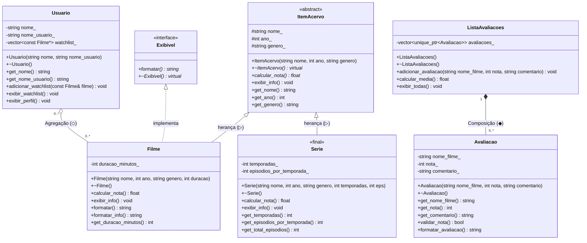

# Letterboxd em C++

**Nome:** Kaio Vitor
**Matrícula:** 20250019634

## Domínio Escolhido
Este projeto é uma versão simplificada do Letterboxd, uma rede social focada em cinema. O sistema permite representar filmes, séries, avaliações dadas a esses itens, coleções de avaliações, e usuários que podem manter uma lista de filmes que desejam assistir (Watchlist).

## Estrutura do Projeto

```
src/
├── main.cpp                          # Ponto de entrada com demonstrações
├── acervo/                           # Hierarquia de herança (filmes, séries)
│   ├── item_acervo.hpp / .cpp        # Classe base abstrata
│   ├── exibivel.hpp                  # Interface pura
│   ├── filme.hpp / .cpp              # Classe concreta (herda ItemAcervo + Exibivel)
│   └── serie.hpp / .cpp              # Classe concreta final (herda ItemAcervo)
├── avaliacao/                        # Sistema de avaliações
│   ├── avaliacao.hpp / .cpp          # Avaliação individual
│   └── lista_avaliacoes.hpp / .cpp   # Composição de avaliações
└── usuario/                          # Gestão de usuários
    └── usuario.hpp / .cpp            # Usuário com watchlist
```

## Diagrama UML



## Relações de Composição e Agregação

*   **Composição (◆)**: `ListaAvaliacoes` *-- `Avaliacao`. A `ListaAvaliacoes` cria e possui as `Avaliacao`s. Quando uma `ListaAvaliacoes` é destruída, todas as suas avaliações internas também são destruídas junto com ela. Uma avaliação não faz sentido neste sistema sem estar vinculada à lista que a armazena.
*   **Agregação (◇)**: `Usuario` o-- `Filme`. O `Usuario` mantém uma lista de ponteiros para objetos `Filme` (sua watchlist). Os filmes existem independentemente do usuário e continuarão a existir no sistema caso o usuário seja excluído. Portanto, a destruição de um `Usuario` não causa a destruição dos `Filme`s que ele referenciou.

## Smart Pointers

*   **`unique_ptr<Avaliacao>` (Composição `ListaAvaliacoes` -> `Avaliacao`)**: Usado na classe `ListaAvaliacoes` para gerenciar as instâncias de `Avaliacao`. Como é uma composição de posse estrita (ownership único), o `unique_ptr` é perfeito para garantir que as avaliações sejam destruídas automaticamente quando a lista for destruída.
*   **`const Filme*` / `const Filme&` (Agregação `Usuario` -> `Filme`)**: Empregamos raw pointers não-proprietários (observadores) para representar a associação de agregação, indicando que o usuário apenas referencia o filme e não gerencia seu tempo de vida (ele é "emprestado"). *(Nota: o uso de referências ou ponteiros raw não-donos é idiomático em C++ moderno para relações de não-posse em oposição a shared_ptr desnecessários).*

## Hierarquia de Herança

O projeto utiliza a hierarquia:

```
ItemAcervo (abstrata) ──▷── Filme (concreta)
                       ──▷── Serie (concreta, final)
```

*   **`ItemAcervo`** — Classe base abstrata que representa qualquer item do acervo cinematográfico. Possui:
    *   `calcular_nota()` — método **virtual puro** (`= 0`), obrigando cada derivada a implementar seu próprio cálculo de nota.
    *   `exibir_info()` — método **virtual não-puro** com implementação padrão que exibe nome, ano e gênero.
    *   `~ItemAcervo()` — **destrutor virtual** que garante a destruição correta da cadeia derivada → base.
*   **`Filme`** — Classe concreta que herda de `ItemAcervo`. Sobrescreve `calcular_nota()` (nota baseada na duração) e `exibir_info()` (chamando `ItemAcervo::exibir_info()` antes de complementar).
*   **`Serie`** — Classe concreta `final` que herda de `ItemAcervo`. Sobrescreve `calcular_nota()` (nota baseada em temporadas) e `exibir_info()` (chamando `ItemAcervo::exibir_info()` antes de complementar).

## Herança Avançada

### Interface Pura: `Exibivel`

A interface `Exibivel` modela a **capacidade** de um objeto ser exibido em formato textual. Ela não possui nenhum atributo de dados (sem estado) e todos os seus métodos são virtuais puros:
*   `formatar() const = 0` — retorna uma representação formatada do objeto como `std::string`.

A classe `Filme` implementa `Exibivel` através de **herança múltipla de interfaces** (`Filme : public ItemAcervo, public Exibivel`). Isso é seguro pois `Exibivel` não possui estado, evitando o problema do diamante.

### Uso de `final`

A classe `Serie` é marcada como `final`, o que significa que **ninguém pode herdar dela**. Essa decisão de design garante que:
1.  A implementação de `calcular_nota()` específica de séries de TV não será alterada por subclasses inesperadas.
2.  O compilador pode otimizar chamadas virtuais em `Serie` pois sabe que não há derivadas.
3.  Preserva a integridade do modelo: no domínio Letterboxd, uma "Série" é um conceito final — não faz sentido ter subtipos de séries.
