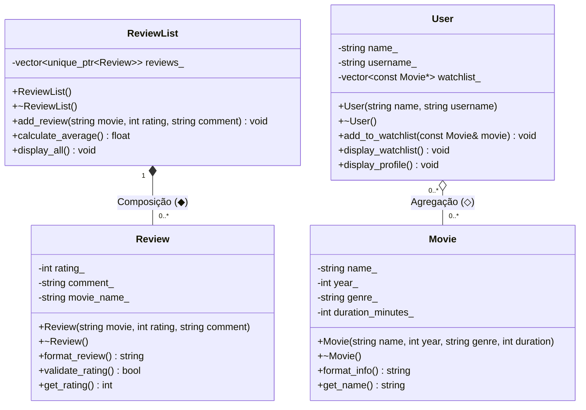

# Catálogo de filmes em C++ (POO)

**Nome:** Kaio Vitor
**Matrícula:** 20250019634

## Domínio Escolhido
Este projeto permite representar filmes, avaliações dadas a esses filmes (Reviews), coleções de avaliações, e usuários que podem manter uma lista de filmes que desejam assistir (Watchlist).

## Diagrama UML

## Relações de Composição e Agregação

*   **Composição (◆)**: `ReviewList` *-- `Review`. O `ReviewList` (lista de avaliações) cria e possui as `Review`s (avaliações individuais). Quando um `ReviewList` é destruído, todas as suas avaliações internas também são destruídas junto com ele. Uma avaliação não faz sentido neste sistema sem estar vinculada à lista que a armazena.
*   **Agregação (◇)**: `User` o-- `Movie`. O `User` mantém uma lista de ponteiros para objetos `Movie` (sua watchlist). Os filmes existem independentemente do usuário e continuarão a existir no sistema caso o usuário seja excluído. Portanto, a destruição de um `User` não causa a destruição dos `Movie`s que ele referenciou.

## Smart Pointers

*   **`unique_ptr<Review>` (Composição `ReviewList` -> `Review`)**: Usado na classe `ReviewList` para gerenciar as instâncias de `Review`. Como é uma composição de posse estrita (ownership único), o `unique_ptr` é perfeito para garantir que as reviews sejam destruídas automaticamente quando a lista for destruída.
*   **`const Movie*` / `const Movie&` (Agregação `User` -> `Movie`)**: Empregamos raw pointers não-proprietários (observadores) para representar a associação de agregação, indicando que o usuário apenas referencia o filme e não gerencia seu tempo de vida (ele é "emprestado"). *(Nota: o uso de referências ou ponteiros raw não-donos é idiomático em C++ moderno para relações de não-posse em oposição a shared_ptr desnecessários).*
